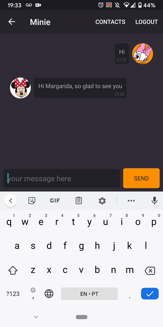
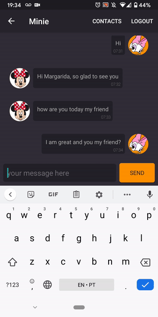

# Yo yo yo

### **Overview - About this project**
This is a simple chat using Firebase


### 📷 How is this App
</img>
</img>
</img>
</img>


### 💻Technology
- [Kotlin](https://kotlinlang.org/)
- [Coil](https://coil-kt.github.io/coil/)
- [Retrofit](https://square.github.io/retrofit/)
- [CircleImageView](https://github.com/hdodenhof/CircleImageView)
- [Jarvis](https://github.com/gilsonjuniorpro/Jarvis)


### Libraries
```bash
    implementation 'com.google.firebase:firebase-core:16.0.1'
    implementation 'com.google.firebase:firebase-auth:16.0.1'
    implementation 'com.google.firebase:firebase-storage:16.0.1'
    implementation 'com.google.firebase:firebase-firestore:15.0.0'
    implementation 'com.github.gilsonjuniorpro:Jarvis:0.2.1'
    implementation "com.xwray:groupie:2.8.0"
    implementation "com.xwray:groupie-kotlin-android-extensions:2.8.0"
    implementation 'de.hdodenhof:circleimageview:2.2.0'
    implementation "io.coil-kt:coil:0.9.1"
 ```
